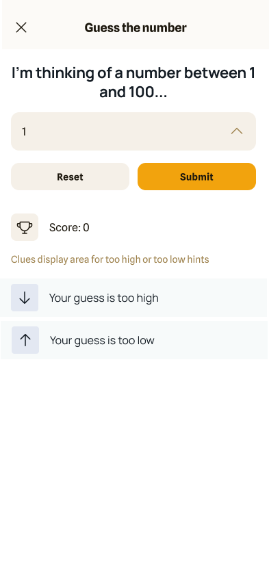

# Flutter - Guess The Number

## Description

Guess The Number is a classic guessing game where players attempt to guess a randomly generated number between 1 and 100. The game features an interactive interface, immediate feedback on guesses, and dynamic messages to guide players through each round. With its simple controls and user-friendly design, Guess The Number offers an enjoyable gaming experience suitable for players of all ages.

## Screenshots / Preview

## Features

- **Guessing Game**: Experience the classic guessing game where players try to guess a randomly generated number between 1 and 100.
- **Random Number Generation**: The game dynamically generates a random number for each round, ensuring a unique challenge every time you play.
- **Interactive Gameplay**: Engage with the game by entering your guess in the provided text field and submitting it to see if you've guessed correctly.
- **Immediate Feedback**: Receive instant feedback on your guess, including whether it's too high, too low, or the correct number, guiding you to adjust your strategy for the next attempt.
- **User-Friendly Interface**: Enjoy a simple and intuitive interface that allows for easy interaction and enhances the overall gaming experience.
- **Dynamic Message Display**: Get clear and dynamic messages displayed on the screen, guiding you through each step of the game and celebrating your successes.
- **Responsive Design**: The game's layout adapts seamlessly to different screen sizes, ensuring optimal performance and usability on various devices.
- **Reset Functionality**: Reset the game at any time with the press of a button, allowing you to start a new round and continue enjoying the fun of guessing.
- **Visual Feedback**: Experience visual feedback through the app's interface elements, providing a visually pleasing and immersive gaming environment.
- **Simple Controls**: Enjoy straightforward controls that make playing the game effortless and enjoyable, suitable for players of all ages.

## Installation

Provide instructions on how to install and run your game. Include any dependencies or setup required.

## Usage

Explain how to use your game. Provide any controls or instructions necessary for players.

## Contributing

If you'd like to contribute to this project, please follow the steps below:

1. Fork the repository
2. Create a new branch (`git checkout -b feature`)
3. Make your changes
4. Commit your changes (`git commit -am 'Add new feature'`)
5. Push to the branch (`git push origin feature`)
6. Create a pull request

## License

This project is licensed under the [MIT License](LICENSE).

## Contact

- Author: [Muhammed Shabeer OP](https://github.com/shabeer-wms)
- Email: support@vectorcrop.com

Feel free to reach out with any questions or feedback!

## Download by paying 😂

https://play.google.com/store/apps/details?id=com.vectorcrop.guess_game